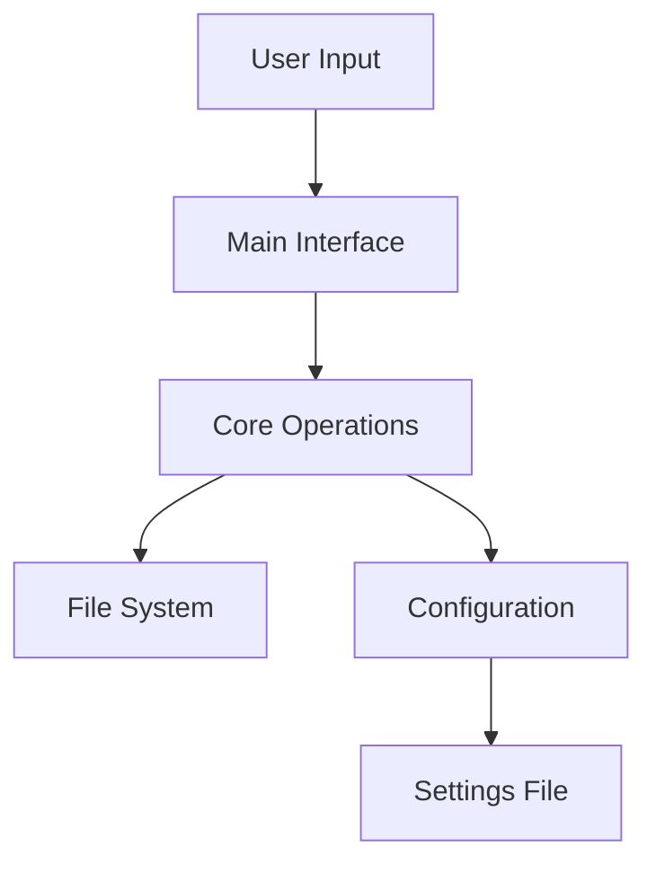

# Source Code Documentation

Technical documentation for the Enhanced Folder Manager source code.

## Module Structure

### Core Modules

#### file_ops.py

* File-level operations
* Information gathering
* Safe file movement
* Type detection

#### dir_ops.py

* Directory management
* Folder creation
* Content analysis
* Recursive operations

#### drive_ops.py

* Volume management
* Drive analysis
* Space monitoring
* Tree visualization

### Configuration

#### settings.py

* Configuration management
* User preferences
* Category definitions
* Path management

## Data Flow



## Type Definitions

```python
PathType = Union[str, Path]
ConfigType = Dict[str, Any]
CategoryType = Dict[str, Dict[str, Union[List[str], int]]]
```

## Error Handling

All operations use try-except blocks with:


1. Specific exception catching
2. Logging
3. User feedback
4. Graceful fallbacks


