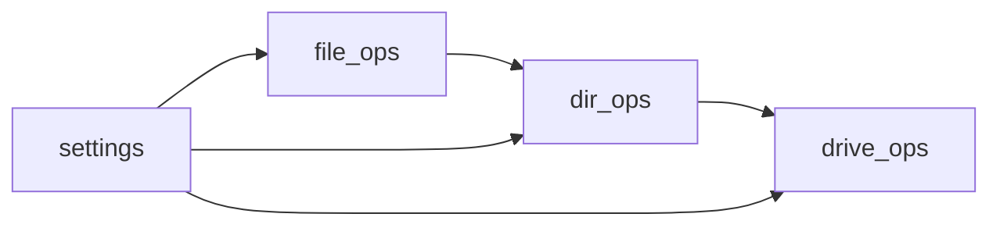

# Core Module Documentation

Technical specifications for core functionality modules.

## Module Interactions

## Operation Flow

### File Operations

1. Path validation
2. Type detection
3. Category assignment
4. Operation execution
5. Status reporting

### Directory Operations

1. Structure analysis
2. Content categorization
3. Bulk operations
4. Progress tracking

### Drive Operations

1. Volume discovery
2. Space analysis
3. Tree building
4. Status monitoring

## Performance Considerations

* Lazy loading for large directories
* Progress tracking for long operations
* Memory efficient tree building
* Caching for frequent operations

