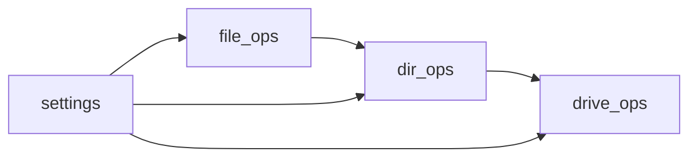

# Core Module Documentation

Technical specifications for core functionality modules.

## Implementation Status

### file_ops.py Status
- [x] Basic file information gathering
- [x] Safe file operations
- [x] Category detection
- [ ] File comparison
- [ ] Duplicate detection
- [ ] Content validation
- [ ] File integrity checks
- [ ] Batch operations

### dir_ops.py Status
- [x] Directory creation
- [x] Content analysis
- [x] Bulk operations
- [x] Progress tracking
- [ ] Directory comparison
- [ ] Recursive operations
- [ ] Permission management
- [ ] Custom filters

### drive_ops.py Status
- [x] Volume discovery
- [x] Space analysis
- [x] Tree visualization
- [ ] Drive health monitoring
- [ ] Performance metrics
- [ ] I/O optimization
- [ ] Cache management
- [ ] Mount point handling

## Module Interactions

## Current Development Focus

### Performance Optimization
- [ ] Implement lazy loading for large directories
- [ ] Add progress tracking for long operations
- [ ] Optimize memory usage in tree building
- [ ] Implement smart caching
- [ ] Add batch operation support

### Error Handling
- [ ] Improve error messages
- [ ] Add recovery mechanisms
- [ ] Implement operation rollback
- [ ] Add validation checks

### Testing
- [ ] Unit tests for all modules
- [ ] Integration tests
- [ ] Performance benchmarks
- [ ] Edge case handling

## Upcoming Features

### File Operations
1. Content-based comparison
2. Advanced duplicate detection
3. File integrity verification
4. Metadata management

### Directory Operations
1. Smart merging
2. Conflict resolution
3. Pattern-based organization
4. Access control management

### Drive Operations
1. Health monitoring
2. Performance optimization
3. Automated maintenance
4. Backup management

## Operation Flow

### File Operations

1. Path validation
2. Type detection
3. Category assignment
4. Operation execution
5. Status reporting

### Directory Operations

1. Structure analysis
2. Content categorization
3. Bulk operations
4. Progress tracking

### Drive Operations

1. Volume discovery
2. Space analysis
3. Tree building
4. Status monitoring

## Performance Considerations

* Lazy loading for large directories
* Progress tracking for long operations
* Memory efficient tree building
* Caching for frequent operations

